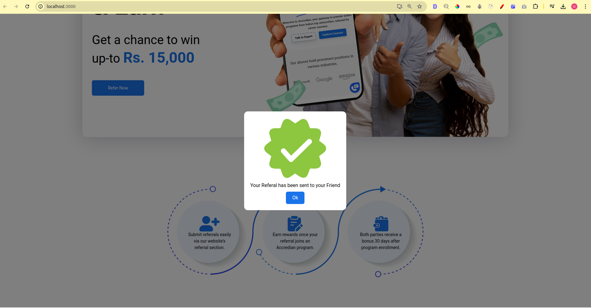

# Getting Started with Create React App


- clone repo using ssh or http
```
git clone git@github.com:github-usman/Accredian-frontend-task.git 
git clone https://github.com/github-usman/Accredian-frontend-task.git
```


### Run in development mode using following command
```
cd Accredian-frontend-task.git 
cp example.env .env
npm install
npm run buid
npm start

```

## Screenshot

### Mobile view


- Landing Page


### DESKTOP
- Landing Page

- Form Pop up

- loading screen

- success 


